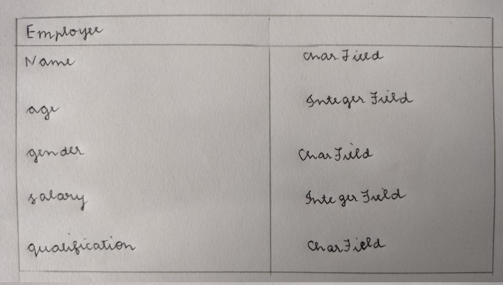
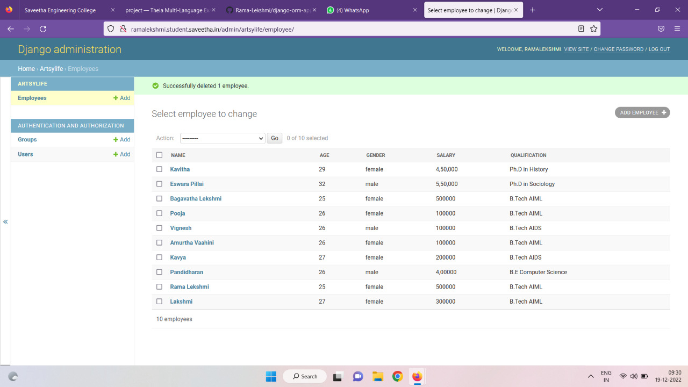

# Django ORM Web Application

## AIM
To develop a Django application to store and retrieve data from a database using Object Relational Mapping(ORM).

## Entity Relationship Diagram

## DESIGN STEPS

### STEP 1:

### STEP 2:

### STEP 3:

Write your own steps

## PROGRAM
## models.py
from django.db import models
from django.contrib import admin
# Create your models here.
class Employee(models.Model):
    name = models.CharField(max_length=1001)
    age = models.IntegerField()
    gender = models.CharField(max_length=101)
    salary = models.CharField(max_length=101)
    qualification = models.CharField(max_length=1001)

class EmployeeAdmin(admin.ModelAdmin):
    list_display = ('name','age','gender','salary','qualification')
## admin.py
from django.contrib import admin
from .models import Employee,EmployeeAdmin
# Register your models here.

admin.site.register(Employee,EmployeeAdmin)
## OUTPUT

## RESULT
